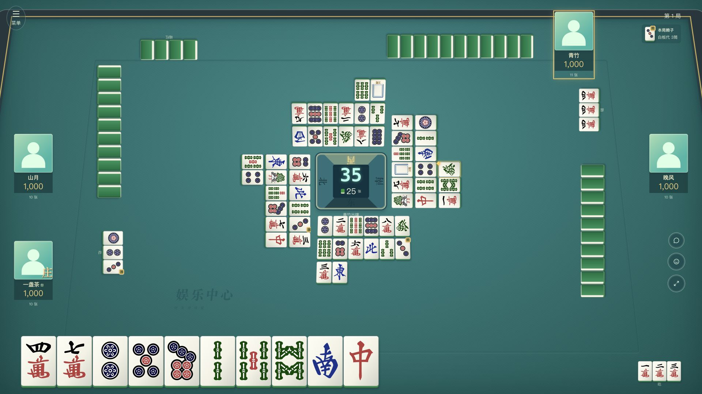
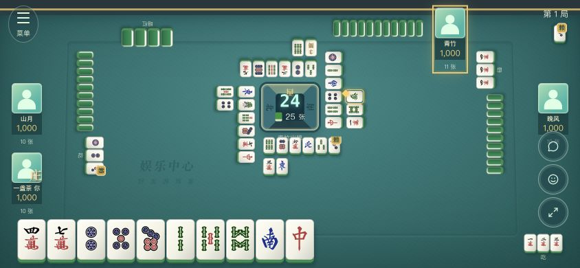
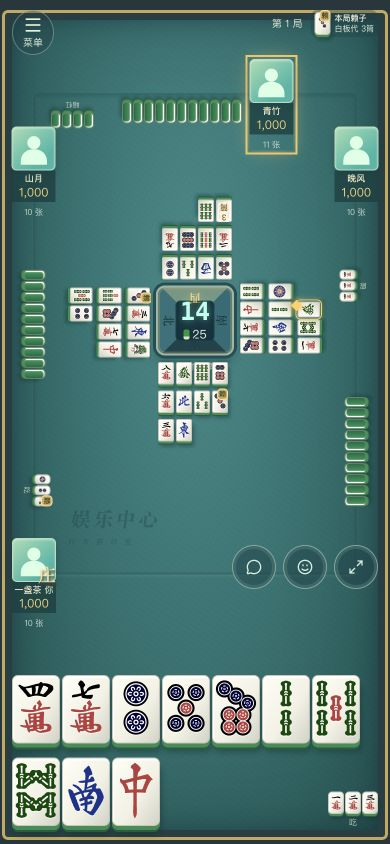
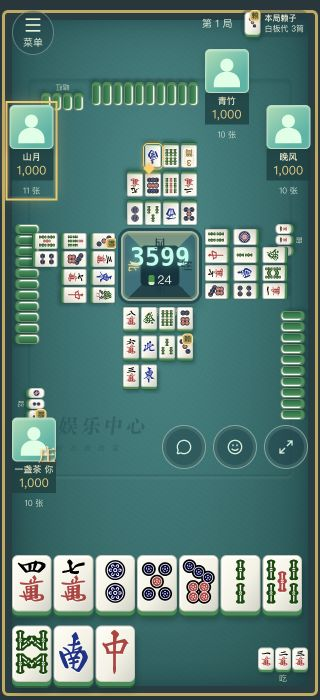

# 麻将整屏四向牌桌验收（2026-09-26）

本轮用整屏桌布、四向外圈手牌、手牌右侧吃碰杠和中央弃牌环替代上一版网页分区布局。头像和操作保持正向。弃牌超过可见范围独立滚动；浏览旧牌时保留位置，并提供回到最新。头像上传在独立 PR 实现。

## 正式产物点击

在 `LOCAL_DEV_TOOLS=0` 的本地正式产物，使用四个独立本地账号。布局压力状态由隔离数据库夹具准备；下列动作通过浏览器真实按钮提交，没有将夹具写入或 HTTP 成功当成交互通过。

- 选择手牌并出牌，手牌从 14 减为 13，弃牌出现，下一位获得行动。
- 吃、碰、明杠分别提交；其他测试账号跳过响应后，组合在本人手牌右侧出现。明杠显示四张并补牌。
- 选择胡牌方案、确认、依次翻两张奖牌，真实结算到账；收起结算查看原位亮牌，再准备下一局。四人准备后对手恢复 39 张牌背，公开暗手牌数量为 0。
- 返回大厅恢复游戏导航，再次回桌；打开完整牌桌、发送文字聊天并收到回执。
- 聚焦弃牌区按 Home 查看旧牌，新增本地夹具弃牌后滚动位置保持 0；点击回到最新后到末尾。
- 页面控制台未观察到警告或错误。

## 布局测量

检查 1920×1080、1440×900、820×900、640×720、844×390、390×844、320×700，另检查 320×568 的极矮竖屏。

- 14 张手牌均在固定手牌区域内，中心点击位置未被遮挡。
- 每家 18 张弃牌相对初始布局，手牌区和操作区坐标变化为 0。
- 本人四组杠、16 张公开牌加 2 张手牌，在七种主要尺寸中均无重叠、无越界；另检查 4 张手牌和多组吃碰杠。
- 四向弃牌采用顺时针错位排列，修正角落交叠。极矮竖屏上移侧边头像，避免头像压住弃牌。
- 窗口尺寸改变时，默认跟随的弃牌区重新定位末尾；手动查看旧牌时保持用户位置。

这些坐标测量证明布局稳定和命中区域可用，不等同于 React 渲染次数、INP 或线上延迟测量。页面根组件已移除 300ms 时钟，相同牌局版本保留状态对象；倒计时、操作到期及声音提醒在各自小组件中更新。

## 截图

## 自动检查

本轮运行 `npm run check`（266 项测试）、`npm run build` 和 `npm run test:smoke`。冒烟测试使用独立本地库；检查数量会随牌局随机路径而变化。最终结果记录在 PR 描述，原始日志位于忽略的 `work/mahjong-ui/`。

## 兼容边界

规则、筹码账本、房间修订号校验和退出流程没有变更。对手牌背只根据服务端 `count` 绘制，暗杠及结算遵守现有可见范围。新牌桌只在实际麻将房间内隐藏站点顶栏；大厅与其他游戏保留原导航。

## 可读性追加验收

- 复制房间号使用浅米色底、深绿色文字和图标；实际点击后「已复制」仍保持同色。默认色为 `#244e46 / #fff8e6`，悬停为 `#183d36 / #f0e5c7`；键盘焦点有独立描边。
- 中央弃牌约放大 20%，同步扩大窄屏弃牌容器；本人吃碰杠的单牌宽度按手牌的 75% 设置，桌面相对原尺寸约增大 88%。四组杠在窄屏按剩余空间收缩，保持完整显示。
- 非当前轮次的四个方位字改为浅色，当前行动方仍以金色高亮。计时和余牌读数改为按中央框尺寸缩放，为方位字保留外圈空间。
- 在本页列出的八种尺寸，以独立本地夹具检查一组碰牌、四组杠和每家 18 张弃牌：吃碰杠与手牌无重叠、无窗口越界；四向弃牌区彼此及与头像无重叠；三位计时数字和余牌读数均处于显示框内，方位字不与显示框重叠。320×568 下额外上移侧边头像。
- 正式产物实际点击复制成功和键盘焦点已检查。`npm run check` 266 项测试、正式构建及本轮独立冒烟 339 项检查通过。以上为本机浏览器的布局与交互结果。
